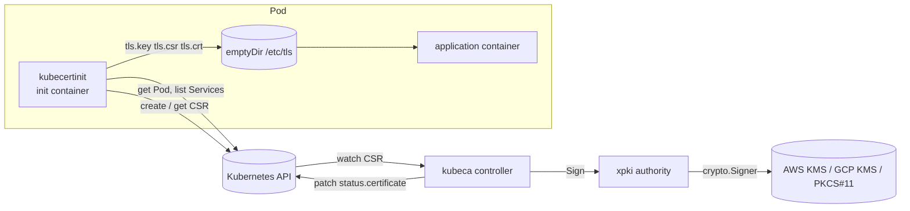

# Current design: init container and the CSR API

Status: shipped. Code: `cmd/kubecertinit`, `internal/certinit`,
`cmd/kubeca`, `internal/controller`. Chart: `examples/kubeca`. Examples:
[`examples/initcontainer`](../../examples/initcontainer).

## Goal

Give every Pod a TLS key pair and an X.509 certificate, issued by a CA whose
private key never leaves KMS or an HSM, using only Kubernetes primitives
(the `certificates.k8s.io/v1` API, RBAC, volumes) and one controller.

## Components

| Component            | Responsibility                                                                                                                                                  |
| -------------------- | --------------------------------------------------------------------------------------------------------------------------------------------------------------- |
| `kubecertinit`       | Discover names, generate the key, create the CSR object, wait for the certificate, write files. Runs once per Pod start.                                        |
| Kubernetes API       | Stores the CSR, records the requester identity, enforces RBAC on `create` and on `sign` (the `signers` resource), garbage-collects CSRs.                           |
| `kubeca` controller  | Watches CSRs, maps `signerName` to an xpki issuer and profile, signs, writes `status.certificate`, emits the `Signed` event.                                     |
| xpki `authority`     | Loads the CA configuration, enforces the profile policy on the CSR (names, extensions, usages, validity) and signs with the provider's `crypto.Signer`.           |
| KMS / HSM            | Holds the CA private key; one signing operation per certificate.                                                                                                |

## Sequence

1. The Pod starts; the kubelet runs the init container with
   `-namespace`, `-pod-name`, `-signer=<label>/<profile>`, `-cert-dir`,
   optional `-query-k8s`, `-san`, `-labels`.
2. With `-query-k8s`, `kubecertinit` reads its Pod and lists the
   namespace's Services, and derives
   `<ip-dashed>.<ns>.pod.<domain>`, `<hostname>.<subdomain>.<ns>.svc.<domain>`,
   and for every Service selecting the Pod `<svc>.<ns>.svc.<domain>`, its
   `ClusterIP` (or `ExternalName`) and `ExternalIPs`. `-san` adds explicit
   names.
3. It generates an ECDSA P-256 key in memory (xpki `inmemcrypto`), builds a
   CSR with the names (xpki validates and deduplicates them) and writes
   `tls.key` and `tls.csr`.
4. It creates the CSR object `<pod>-<ns>-<5 random chars>` with
   `spec.signerName`, `spec.usages` from its profile table and the
   `-labels`. The API server records `spec.username`, `uid`, `groups` and
   `extra` from the ServiceAccount token.
5. The controller's reconcile sees the CSR, skips it if it is being
   deleted, has no signer, already has a certificate or is `Denied`, and
   otherwise resolves the issuer by profile and label.
6. `authority.Issuer.Sign` parses the CSR, copies the subject and names
   allowed by the profile (`allowed_fields`, regexes), drops every CSR
   extension not in `allowed_extensions`, sets usages, validity
   (`NotBefore = now − backdate`, `NotAfter = NotBefore + expiry`), SKI/AKI,
   and signs with the KMS key.
7. The controller patches `status.certificate` with the leaf PEM followed
   by the issuer chain, emits `Signed`, records `perf_ca_signreq`.
8. `kubecertinit`, polling every 5 s, reads the certificate, writes
   `tls.crt` and exits 0; a `Denied` or `Failed` condition, a deleted CSR
   or an elapsed `-timeout` exits 2 instead. The application containers
   start.

Timing: discovery and key generation take milliseconds; issuance is one
reconcile plus one KMS call (tens of milliseconds); the poll interval adds
up to 5 s. A Pod typically starts 1 to 6 s later than without the init
container.

## Configuration surfaces

| Surface                       | Where                                                   | Notes                                                                                                        |
| ----------------------------- | ------------------------------------------------------- | ------------------------------------------------------------------------------------------------------------ |
| Issuers and profiles          | `examples/kubeca/etc/ca-config.kubeca.yaml`                 | Issuer `label` = signer domain; profile name = signer path. Lifetime, usages, name policy per profile.       |
| Crypto provider               | `examples/kubeca/etc/*.yaml`, `-hsm-cfg`                    | The token config names `AWSKMS`, `GCPKMS`, `SoftHSM` or `PKCS11`; the `-1`/`-2` aliases were removed in v0.8 |
| Controller RBAC               | `examples/kubeca/templates/role-csr-signer.yaml`            | `sign` on `signers` with `resourceNames: [kubeca.svc/*]` limits which signer names this controller may serve |
| Workload RBAC                 | `examples/initcontainer/rbac.yaml`                      | `create/get/list/watch` CSRs (ClusterRole), `get/list` Pods and Services in the workload's namespace (Role) |
| Names                         | `-query-k8s`, `-san`, `-cluster-domain`, `-include-unqualified` | Validated by xpki; the profile's regexes decide what is accepted                                    |

## Security model

- **Trust anchor.** The CA key is in KMS; the controller's ServiceAccount
  (IRSA) is the only principal with `kms:Sign`. Compromise of the
  controller Pod equals compromise of the CA's signing ability, not of the
  key.
- **Who can request.** Anyone bound to `csr-creator`. CSRs are
  cluster-scoped, so the binding is a ClusterRoleBinding; there is no
  per-namespace limit. The API server records the requester in the CSR but
  the controller does not use it.
- **What they get.** Whatever the profile allows. The shipped profiles copy
  DNS, IP and URI names from the CSR and leave the regexes commented out,
  so any requester can obtain a certificate for any name. Set `allowed_dns`
  and `allowed_uri` in production.
- **Approval.** None. The controller signs every CSR for its signer names
  that is not `Denied` (KUBECA-001; decided: an automatic in-controller
  approver that checks the names against the requester's Pods and
  Services, see ROADMAP). The `kubeca:csr-approver` ClusterRole in the
  chart is unused until then.
- **Key handling.** The key is generated in the init container, written
  with mode `0644` to the shared volume (KUBECA-003) and never leaves the
  node. Use `emptyDir.medium: Memory` so it is not written to disk.
- **Trust distribution.** `tls.crt` carries the issuer chain but not the
  root; clients need the root from another channel (a ConfigMap, the
  image), see ROADMAP "Trust distribution".
- **Audit.** The CSR object (requester, names, issued certificate) stays in
  the cluster until the CSR cleaner removes it; the controller logs every
  issuance with issuer, profile and the certificate text.

## Failure modes

| Failure                                        | Effect                                                                                                                | Recovery                                                                       |
| ---------------------------------------------- | --------------------------------------------------------------------------------------------------------------------- | ------------------------------------------------------------------------------ |
| Controller down                                | CSRs stay pending; Pods stay in `Init` (with `-timeout`, the init container exits 2 and the kubelet restarts it with backoff) | Restart the controller; pending CSRs are signed on start-up (list + watch) |
| KMS unavailable or access denied               | `unable to sign` with backoff retries (up to ~16 min between attempts); `SigningFailed` events on the CSR                | Fix IAM/KMS; retries succeed                                                   |
| Profile rejects the CSR (name, extension)      | Same retry loop although the error is permanent, with `SigningFailed` events; the CSR is never marked `Failed` (KUBECA-013); init waits until `-timeout` (for ever by default, KUBECA-006) | Fix the request and delete the Pod |
| Wrong `-signer`                                | `unsupported signer`/`unsupported profile` (exit 2) or `issuer not found` in the controller log                        | Fix the flag                                                                   |
| RBAC missing on the workload                   | `forbidden` creating the CSR, exit 2; the Pod restarts the init container (CrashLoopBackOff)                           | Bind `csr-creator`                                                             |
| Certificate expires                            | Nothing renews it; TLS fails after `expiry`                                                                            | Restart the Pod                                                                |
| CSR deleted while waiting                      | `certificate signing request not found`, exit 2                                                                       | The Pod restarts the init container, which creates a new CSR                   |

## Limitations that motivate the operator

1. **No renewal.** A certificate is issued once per Pod lifetime, so the
   profiles use `8760h`. Short lifetimes are impossible without restarting
   Pods.
2. **Key file mode and location.** `0644` on a shared volume; every
   container in the Pod can read the key.
3. **Blocking start.** The Pod cannot start until the CA signs; there is no
   timeout unless `-timeout` is set.
4. **Policy only at the CA.** Approval is implicit, and the name policy is
   a per-profile regex with no notion of namespace or ServiceAccount. A
   requester in one namespace can request names of another.
5. **No trust distribution.** The root is not delivered with the
   certificate.
6. **Cluster-wide RBAC.** Every requesting ServiceAccount needs a
   ClusterRoleBinding to create CSRs.
7. **Operational visibility.** Status lives in CSR objects that are
   garbage-collected within hours; there is no object that says "this
   workload's certificate expires at T".

The operator design keeps this flow working and adds a `Certificate`
resource whose lifecycle (issue, renew, rotate, re-issue on change) the
controller owns: [operator.md](operator.md).
