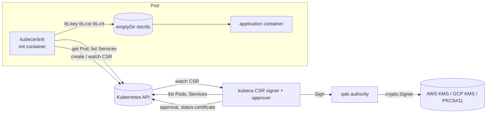

# Deprecated design: init container and the CSR API

Status: deprecated since v0.9, kept for the migration period. Code:
`cmd/kubecertinit`, `internal/certinit`, `internal/controller`. Chart:
`examples/kubeca` (`csrSigner.*` values). Examples:
[`examples/initcontainer`](../../examples/initcontainer). Replacement:
[operator.md](operator.md) (a `Certificate` per workload or the inject
label per Pod; README, "Migrating from the init container").

## Goal

Give every Pod a TLS key pair and an X.509 certificate, issued by a CA whose
private key never leaves KMS or an HSM, using only Kubernetes primitives
(the `certificates.k8s.io/v1` API, RBAC, volumes) and one controller.

## Components

| Component            | Responsibility                                                                                                                                                  |
| -------------------- | --------------------------------------------------------------------------------------------------------------------------------------------------------------- |
| `kubecertinit`       | Discover names, generate the key, create the CSR object, watch it for the certificate, write files. Runs once per Pod start.                                     |
| Kubernetes API       | Stores the CSR, records the requester identity, enforces RBAC on `create`, `approve` and `sign` (the `signers` resource), garbage-collects CSRs.                 |
| `kubeca` CSR signer  | Watches CSRs, maps `signerName` to an xpki issuer and profile, approves or denies (`-approve`), signs, writes `status.certificate` or the `Failed` condition.     |
| xpki `authority`     | Loads the CA configuration, enforces the profile policy on the CSR (names, extensions, usages, validity) and signs with the provider's `crypto.Signer`.           |
| KMS / HSM            | Holds the CA private key; one signing operation per certificate.                                                                                                |

## Sequence

1. The Pod starts; the kubelet runs the init container with
   `-namespace`, `-pod-name`, `-signer=<label>/<profile>`, `-cert-dir`,
   optional `-query-k8s`, `-san`, `-labels`, `-timeout` (10 minutes by
   default).
2. With `-query-k8s`, `kubecertinit` reads its Pod and lists the
   namespace's Services, and derives (`internal/k8snames`)
   `<ip-dashed>.<ns>.pod.<domain>`, `<hostname>.<subdomain>.<ns>.svc.<domain>`,
   and for every Service selecting the Pod `<svc>.<ns>.svc.<domain>`, its
   `ClusterIP` (or `ExternalName`) and `ExternalIPs`. `-san` adds explicit
   names.
3. It generates an ECDSA P-256 key in memory (xpki `inmemcrypto`), builds a
   CSR with the names (xpki validates and deduplicates them) and writes
   `tls.key` and `tls.csr`.
4. It creates the CSR object `<pod>-<ns>-<5 random chars>` with
   `spec.signerName`, `spec.usages` from its profile table and the
   `-labels`. The API server records `spec.username`, `uid`, `groups` and
   `extra` from the ServiceAccount token.
5. The controller's reconcile sees the CSR, skips it if it is being
   deleted, has no signer, already has a certificate or is `Denied` or
   `Failed`, and otherwise resolves the issuer by profile and label.
6. With `-approve=enforce` (the chart default) and no `Approved`
   condition, the approver checks that the requester is a ServiceAccount
   and that every name of the CSR (common name, DNS, IP, URI, email) is
   one its Pods may carry: the Pod IPs and DNS names, hostname/subdomain,
   the names and IPs of the Services selecting those Pods, the SPIFFE ID
   `spiffe://<any trust domain>/ns/<ns>/sa/<sa>`, and the
   `-approve-allowed-names` (`localhost`, `127.0.0.1`). It sets `Approved`
   (reason `KubeCAApproved`) or `Denied` (reason `NamesNotAllowed`, the
   offending names in the message) through the approval subresource and
   returns; the update triggers the reconcile that signs. With `audit`
   the CSR is signed anyway and a `Warning` event `ApprovalAudit` reports
   what `enforce` would deny; with `off` nothing is checked (the pre-0.9
   behaviour). A CSR approved by another principal is signed without
   evaluation.
7. `authority.Issuer.Sign` parses the CSR, copies the subject and names
   allowed by the profile (`allowed_fields`, regexes), drops every CSR
   extension not in `allowed_extensions`, sets usages, validity
   (`NotBefore = now − backdate`, `NotAfter = NotBefore + expiry`), SKI/AKI,
   and signs with the KMS key. A request the profile rejects gets the
   `Failed` condition (reason `SigningFailed`) and is not retried
   (`internal/signerr`); a KMS or API error is retried with backoff.
8. The controller patches `status.certificate` with the leaf PEM followed
   by the issuer chain, emits `Signed`, records `perf_ca_signreq`.
9. `kubecertinit`, watching the CSR (a field-selected watch from its
   resource version, reopened when it ends; a 5 s poll only when the
   watch cannot be opened), reads the certificate, writes `tls.crt` and
   exits 0; a `Denied` or `Failed` condition, a deleted CSR or an elapsed
   `-timeout` exits 2 and the kubelet restarts the init container with
   backoff. The application containers start.

Timing: discovery and key generation take milliseconds; approval and
issuance are two reconciles and one KMS call (tens of milliseconds); the
watch delivers the certificate within a second. A Pod typically starts 1
to 2 s later than without the init container.

## Configuration surfaces

| Surface                       | Where                                                   | Notes                                                                                                        |
| ----------------------------- | ------------------------------------------------------- | ------------------------------------------------------------------------------------------------------------ |
| Issuers and profiles          | `examples/kubeca/etc/ca-config.kubeca.yaml`             | Issuer `label` = signer domain; profile name = signer path. The year-long `peer`, `server`, `client` profiles exist for this flow |
| Crypto provider               | `examples/kubeca/etc/*.yaml`, `-hsm-cfg`                | The token config names `AWSKMS`, `GCPKMS`, `SoftHSM` or `PKCS11`                                              |
| Approval                      | `csrSigner.approve`, `csrSigner.allowedNames` (`-approve`, `-approve-allowed-names`) | `off`, `audit`, `enforce`                                                        |
| Controller RBAC               | `examples/kubeca/templates/role-csr-signer.yaml`        | `sign` and `approve` on `signers` with `resourceNames: [kubeca.svc/*]`, `certificatesigningrequests/approval`, Pods and Services (read) |
| Workload RBAC                 | `examples/initcontainer/rbac.yaml`                      | `create/get/list/watch` CSRs (ClusterRole `kubeca:csr-creator`, also renderable by the chart with `csrSigner.createCSRCreatorRole`), `get/list` Pods and Services in the workload's namespace (Role) |
| Names                         | `-query-k8s`, `-san`, `-cluster-domain`, `-include-unqualified` | Validated by xpki; the approver and the profile's regexes decide what is accepted                     |

## Security model

- **Trust anchor.** The CA key is in KMS; the controller's ServiceAccount
  (IRSA) is the only principal with `kms:Sign`. Compromise of the
  controller Pod equals compromise of the CA's signing ability, not of the
  key.
- **Who can request.** Anyone bound to `csr-creator`. CSRs are
  cluster-scoped, so the binding is a ClusterRoleBinding; there is no
  per-namespace limit. The API server records the requester in the CSR
  and the approver uses it.
- **What they get.** With `enforce`, only names their own Pods and
  Services have, plus the allowed names; the profile regexes still apply.
  With `off`, whatever the profile allows: set `allowed_dns` and
  `allowed_uri` in production or use `enforce`.
- **Approval.** The in-process approver (KUBECA-001, fixed in v0.9),
  mode per `-approve`. An external approver (`kubectl certificate
  approve`) is honoured too.
- **Key handling.** The key is generated in the init container, written
  with mode `0644` to the shared volume (KUBECA-003) and never leaves the
  node. Use `emptyDir.medium: Memory` so it is not written to disk.
- **Trust distribution.** `tls.crt` carries the issuer chain but not the
  root; clients need the root from another channel (the operator's
  `ca.crt` or the `caBundle` ConfigMap of a `ClusterIssuer`).
- **Audit.** The CSR object (requester, names, approval, issued
  certificate) stays in the cluster until the CSR cleaner removes it; the
  controller logs every approval and issuance with issuer, profile and
  serial.

## Failure modes

| Failure                                        | Effect                                                                                                                | Recovery                                                                       |
| ---------------------------------------------- | --------------------------------------------------------------------------------------------------------------------- | ------------------------------------------------------------------------------ |
| Controller down                                | CSRs stay pending; the init container exits 2 after `-timeout` (10 m) and the kubelet restarts it with backoff (a new CSR per attempt) | Restart the controller; pending CSRs are approved and signed on start-up |
| KMS unavailable or access denied               | `unable to sign, retrying` with backoff (up to ~16 min between attempts); `SigningFailed` events on the CSR              | Fix IAM/KMS; retries succeed                                                   |
| Profile rejects the CSR (name, extension)      | `Failed` condition (`SigningFailed`) at once, no retry; the init container exits 2                                      | Fix the request and delete the Pod                                             |
| Names outside the requester's Pods/Services (`enforce`) | `Denied` condition (`NamesNotAllowed`); the init container exits 2                                            | Fix `-san`, or add the name to `-approve-allowed-names`                        |
| Requester is not a ServiceAccount (`enforce`)  | `Denied`                                                                                                               | Use `kubectl certificate approve`, or `audit`                                  |
| Wrong `-signer`                                | `unsupported signer`/`unsupported profile` (exit 2) or `issuer not found` in the controller log                        | Fix the flag                                                                   |
| RBAC missing on the workload                   | `forbidden` creating the CSR, exit 2; the Pod restarts the init container (CrashLoopBackOff)                           | Bind `csr-creator`                                                             |
| Watch unavailable                              | The init container polls every 5 s until the watch can be opened                                                       | none                                                                           |
| Certificate expires                            | Nothing renews it; TLS fails after `expiry`                                                                            | Restart the Pod, or migrate to the operator                                    |
| CSR deleted while waiting                      | `certificate signing request not found`, exit 2                                                                       | The Pod restarts the init container, which creates a new CSR                   |

## Limitations that motivate the operator

1. **No renewal.** A certificate is issued once per Pod lifetime, so the
   profiles use `8760h`. Short lifetimes are impossible without restarting
   Pods.
2. **Key file mode and location.** `0644` on a shared volume; every
   container in the Pod can read the key (KUBECA-003).
3. **Blocking start.** The Pod cannot start until the CA signs (bounded by
   `-timeout`).
4. **Policy at approval only.** The approver binds names to the
   requester's Pods and Services, but there is no per-namespace policy
   object, no `maxDuration`, no policy on the profile.
5. **No trust distribution.** The root is not delivered with the
   certificate.
6. **Cluster-wide RBAC.** Every requesting ServiceAccount needs a
   ClusterRoleBinding to create CSRs.
7. **Operational visibility.** Status lives in CSR objects that are
   garbage-collected within hours; there is no object that says "this
   workload's certificate expires at T".

The operator keeps this flow working and adds the `Certificate` resource
whose lifecycle (issue, renew, rotate, re-issue on change) the controller
owns: [operator.md](operator.md).
