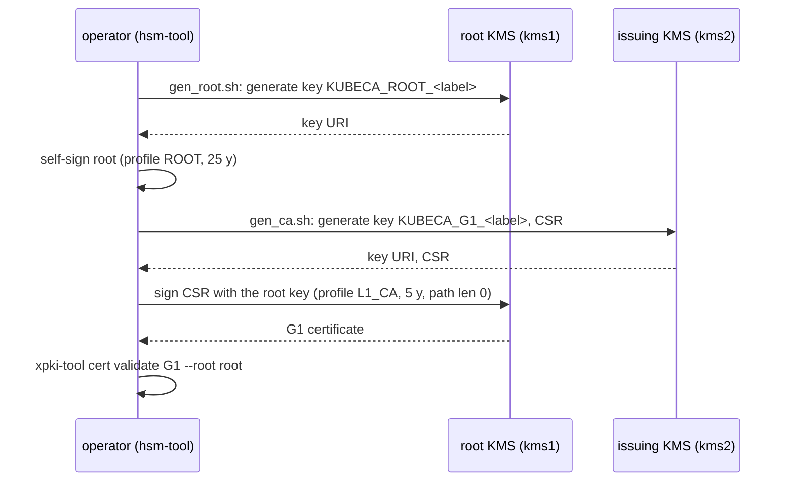

# Key ceremony: root CA and G1 issuing CA

How the kubeca CA hierarchy is created. The root key lives on one KMS that
is used only during the ceremony (offline in production); the issuing CA
(G1) key lives on the KMS kubeca runs with. Only a CSR goes to the root and
only a certificate comes back, so the two KMS configurations are never
loaded together.



## Inputs

| File                                                    | Purpose                                                                                                          |
| ------------------------------------------------------- | ---------------------------------------------------------------------------------------------------------------- |
| `etc/ca-config.bootstrap.yaml`                          | xpki profiles `ROOT` (self-signed, `max_path_len: -1`, 219150h) and `L1_CA` (`issuer_label: ROOT`, `max_path_len: 0`, 43800h) |
| `etc/csr_profile/{dev,prod}/kubeca_root.yaml`           | Root subject (`O=cluster.local, OU=kubeca-dev-root` / `kubeca-root`) and key (ECDSA P-256)                        |
| `etc/csr_profile/{dev,prod}/kubeca_ca_g1.yaml`          | G1 subject (`OU=kubeca-dev-signer` / `kubeca-signer`) and key                                                     |
| `etc/aws-dev-kms-local1.yaml`, `local2.yaml`            | Token configs of the two local-kms emulators (`docker-compose.yml`: kms1 on 14599, kms2 on 24599), model `effective-security-test` |
| `examples/kubeca/etc/aws-kms-<region>.yaml`             | Token config of a real AWS KMS (IAM through the default credential chain)                                         |

The `model` in a token config is part of the key URI that `hsm-tool` writes
to `<out>.key`; kubeca resolves the issuing key by manufacturer and model,
so the runtime token config must use the same `model` as the ceremony
(`examples/kubeca/etc/aws-dev-kms-minikube.yaml` does).

## Scripts

| Script                       | Does                                                                                                                                   |
| ---------------------------- | -------------------------------------------------------------------------------------------------------------------------------------- |
| `scripts/gen_root.sh`        | `hsm-tool csr gen-cert --self-sign` on the root KMS; writes `<out>.key` (key URI, 0600), `<out>.csr`, `<out>.pem`; keeps an existing `.pem` unless `--force` |
| `scripts/gen_ca.sh`          | `hsm-tool csr create` on the issuing KMS, then `hsm-tool csr sign` with the root key on the root KMS (`--root-hsm-config`); validates the chain with `xpki-tool` |
| `scripts/make_kubeca.sh`     | Root wrapper driven by `HSM_CONFIG`, `CA_CONFIG`, `CSR_FOLDER`, `OUT_DIR`, `KEY_LABEL`, `FORCE`                                       |
| `scripts/make_kubeca_g1.sh`  | G1 wrapper; adds `ROOT_HSM_CONFIG`, `ROOT_CA`, `ROOT_CA_KEY`                                                                            |

Outputs go to `OUT_DIR` (`.tmp`, ignored by Git):
`kubeca_root_<label>.{key,csr,pem}` and `kubeca_ca_g1_<label>.{key,csr,pem}`.
The `.key` files hold KMS key URIs, not key material, but they name the
key: treat them as configuration secrets.

## Local ceremony (emulators)

```sh
make start-local-kms          # docker compose: kms1 :14599 (root), kms2 :24599 (issuing)
make kubeca-ceremony-local    # = kubeca-root-local + kubeca-g1-local, KEY_LABEL=local
```

local-kms keeps keys in memory: after `make stop-local-kms` or a container
recreate the keys are gone and the certificates must be regenerated
(`FORCE=--force make kubeca-ceremony-local`). The emulator ignores
credentials; the SDK still needs the dummy `AWS_*` variables the Makefile
sets.

Verified on 2026-10-06 with hsm-tool from xpki v1.0: root `O=cluster.local,
OU=kubeca-dev-root`, 25 years, path length unlimited; G1 `OU=kubeca-dev-signer`,
5 years, path length 0, `IKID` equal to the root `SKID`; `xpki-tool cert
validate` accepts the chain.

## Production ceremony (AWS KMS)

```sh
# root: on the root account/KMS, from a workstation with its IAM role
make kubeca-root-aws ROOT_HSM_CONFIG=etc/aws-kms-root.yaml AWS_KEY_LABEL=2026q4
# G1: generate the key on the issuing KMS, sign with the root
make kubeca-g1-aws HSM_CONFIG=examples/kubeca/etc/aws-kms-us-west-2.yaml \
    ROOT_HSM_CONFIG=etc/aws-kms-root.yaml AWS_KEY_LABEL=2026q4
```

`AWS_KEY_LABEL` defaults to a timestamp evaluated once per `make`
invocation, so pass the root's label to a later G1 run, or use
`make kubeca-ceremony-aws` for both steps with one label; both use
`etc/csr_profile/prod`. The IAM principal of the root step needs
`kms:CreateKey`, `kms:GetPublicKey`, `kms:Sign` on the root KMS; the G1 step
needs `kms:CreateKey`/`GetPublicKey` on the issuing KMS and `kms:Sign`
on the root key. Record the key ids (`.key` files) and the certificates in
the ceremony log; kubeca needs `kubeca_ca_g1_<label>.pem`, the `.key` URI
and `kubeca_root_<label>.pem` in its certs Secret (README, "Install").

## What the ceremony does not do

No AIA, CRL or OCSP URLs (the bootstrap profiles leave them out; kubeca
issues short-lived leaf certificates instead of revoking), no key
rotation procedure (a new label makes a new hierarchy; CA rotation is in
ROADMAP), and no hardware-backed quorum: local-kms and a single IAM role
stand in for the ceremony controls a real root requires.
