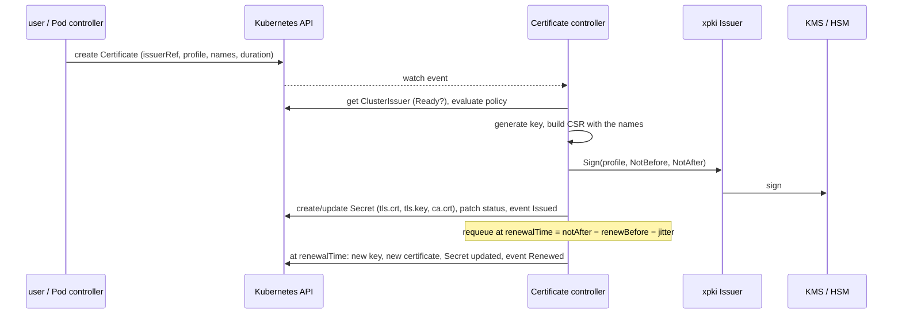

# kubeca

Certificate authority for Kubernetes workloads, built on
[xpki](https://github.com/effective-security/xpki). `kubeca` runs an
operator that issues short-lived certificates (24 h by default) into
`kubernetes.io/tls` Secrets and renews them before they expire, with the CA
key held in AWS KMS, GCP KMS or a PKCS#11 token. Workloads ask for a
certificate with a `Certificate` object, or by labeling their Pod. The
same binary signs `certificates.k8s.io/v1` CertificateSigningRequests for
the deprecated init-container flow (`kubecertinit`).

Design: [`Documentation/design/operator.md`](Documentation/design/operator.md)
and the API in [`operator-api.md`](Documentation/design/operator-api.md).
Release notes: [`Documentation/RELEASE_NOTES_0.9.md`](Documentation/RELEASE_NOTES_0.9.md).

## Components

| Component      | Image                            | Runs as                                   | Role                                                                                                                                        |
| -------------- | -------------------------------- | ----------------------------------------- | ------------------------------------------------------------------------------------------------------------------------------------------- |
| `kubeca`       | `effectivesecurity/kubeca`       | Deployment (Helm chart `examples/kubeca`) | The operator (`ClusterIssuer`, `Certificate` and Pod controllers, Pod mutating webhook) and the CSR signer with its approver, in one manager |
| `kubecertinit` | `effectivesecurity/kubecertinit` | Init container (deprecated)               | Generates a key, submits a CSR for the Pod, waits for the certificate, writes files                                                         |
| `certmonitor`  | `effectivesecurity/certmonitor`  | Container of `examples/shop/pod.yaml` (test) | Prints a certificate and every renewal of it; built and loaded into minikube by `make minikube-images`, not published by CI           |

| Package                         | Purpose                                                                                                 |
| ------------------------------- | ------------------------------------------------------------------------------------------------------- |
| `api/v1alpha1`                  | `Certificate` and `ClusterIssuer` types, constants (labels, annotations, conditions, reasons), deepcopy |
| `cmd/kubeca`                    | Entry point: flags, provider registration, log setup, manager construction, controller registration    |
| `cmd/kubecertinit`              | Init-container entry point (deprecated)                                                                 |
| `cmd/certmonitor`               | Test tool: watches a key pair (porto `tlsconfig` reloader) and prints the certificate on every renewal  |
| `internal/operator`             | Manager wiring: scheme, cache selectors, webhook server, `Setup`; the envtest CRD test                  |
| `internal/operator/issuer`      | ClusterIssuer controller: issuer resolution, status, CA expiry, CA bundle ConfigMaps                    |
| `internal/operator/certificate` | Certificate controller: issuance pipeline, Secret handling, renewal decision                             |
| `internal/operator/pod`         | Pod controller: a Certificate per labeled Pod                                                           |
| `internal/operator/webhook`     | Pod mutating webhook and its self-issued serving certificate                                            |
| `internal/operator/policy`      | ClusterIssuer policy evaluation (namespace selector, name regexes, duration bound)                       |
| `internal/operator/index`       | Field indexes the controllers list Certificates by                                                     |
| `internal/operator/metrics`     | Prometheus metrics of the operator                                                                      |
| `internal/controller`           | CSR signer with the in-process approver and the `Failed` condition                                      |
| `internal/certinit`             | The init-container flow (deprecated)                                                                    |
| `internal/k8snames`             | Pod and Service name derivation shared by the approver, the Pod controller and `certinit`              |
| `internal/signerr`              | Permanent vs transient classification of xpki `Sign` errors                                             |
| `internal/testauthority`        | Test-only in-memory Authority built from the example CA configuration                                   |
| `internal/logr`                 | xlog adapter for controller-runtime's go-logr                                                           |
| `internal/version`              | Build version, linked by `make build`; printed by `-version`                                            |

## How it works



A `ClusterIssuer` binds an issuer of the xpki CA configuration
(`authority.issuers[].label`, `kubeca.svc` in the chart) to the profiles it
exposes and a policy (which namespaces may use it, which names are
allowed, the maximum lifetime). A `Certificate` in a namespace names the
issuer, a profile and the names it needs; the controller writes the
Secret and keeps it valid. The kubelet updates the mounted files on every
renewal, so the application must reload them (for example with porto's
`tlsconfig.NewKeypairReloader`).

Two ways to get a certificate into a Pod:

1. **A `Certificate` per workload** (Deployments, StatefulSets): the Pod
   mounts `spec.secretName` as a Secret volume
   ([`examples/shop/certificate.yaml`](examples/shop/certificate.yaml),
   [`statefulset.yaml`](examples/shop/statefulset.yaml) with a wildcard
   name over the headless Service).
2. **A certificate per Pod** with the label
   `kubeca.effectivesecurity/inject: "true"` and the `issuer` annotation:
   the Pod controller creates a `Certificate` owned by the Pod with the
   Pod's DNS name, the Services that select it, its IP and the SPIFFE ID of
   its ServiceAccount; the webhook adds the Secret volume and the mounts
   at admission, so nothing TLS-related is written in the Pod template
   ([`examples/shop/pod.yaml`](examples/shop/pod.yaml),
   [`deployment-injected.yaml`](examples/shop/deployment-injected.yaml)).

## Install

### Prerequisites

- Kubernetes 1.26 or later (CEL validation rules in the CRDs); 1.30 or
  later for the chart's `ValidatingAdmissionPolicy`, which guards the
  Certificates of the Pod flow (not rendered on older clusters). The
  module builds against client-go v0.37.
- An issuing CA whose private key is in KMS or an HSM, created with xpki's
  `hsm-tool` (`make tools` installs it). You need three files: the issuing
  CA certificate, its key reference (a `pkcs11:` or KMS key URI, or the
  PEM the provider exports) and the root certificate.
- For AWS KMS: an IAM role with `kms:Sign`, `kms:GetPublicKey` and
  `kms:DescribeKey` on the key, bound to the controller's ServiceAccount
  (IRSA, `serviceAccount.annotations` in the chart values).

### Helm

With the release name `kubeca`, the chart's full name is `kubeca` and the
Deployment mounts the Secret `kubeca-certs-secret-tf` (`certs.secretName`),
which the chart does not create. Helm installs the CRDs of `crds/` on
install only; apply them yourself before an upgrade:

```sh
kubectl create namespace kubeca
kubectl -n kubeca create secret generic kubeca-certs-secret-tf \
  --from-file=kubeca_ca_g1.pem --from-file=kubeca_ca_g1.key --from-file=kubeca_root.pem
kubectl apply -f examples/kubeca/crds/
helm upgrade --install kubeca examples/kubeca -n kubeca -f examples/kubeca/aws-dev.yaml \
  --set 'serviceAccount.annotations.eks\.amazonaws\.com/role-arn=arn:aws:iam::123456789012:role/kubeca'
kubectl -n kubeca logs deploy/kubeca
kubectl get clusterissuer                    # the chart creates `kubeca`; READY True
```

The chart is the whole CA side ([`examples/kubeca/README.md`](examples/kubeca/README.md)):
CRDs, controller, RBAC, CA configuration and profiles, the `ClusterIssuer`
(`values.clusterIssuers`) and the webhook. Applications deploy only
`Certificate`s or labeled Pods in their own namespaces
([`examples/shop`](examples/shop/README.md)).

`examples/kubeca/local.yaml` targets a local KMS emulator with dummy
credentials. Render before installing:

```sh
helm lint examples/kubeca -f examples/kubeca/local.yaml
helm template kubeca examples/kubeca -f examples/kubeca/local.yaml --namespace kubeca
```

`helm template` without a cluster does not know the cluster serves
`ValidatingAdmissionPolicy`; add
`--api-versions admissionregistration.k8s.io/v1/ValidatingAdmissionPolicy`
to render the admission policy too. `helm install` reads it from the
cluster.

Chart values that matter:

| Value                            | Default                      | Meaning                                                                                                              |
| -------------------------------- | ---------------------------- | -------------------------------------------------------------------------------------------------------------------- |
| `operator.enabled`               | `true`                       | Run the ClusterIssuer, Certificate and Pod controllers (`-enable-operator`); leader election is on in operator mode  |
| `operator.podCertificatePolicy`  | `true`                       | Render the `ValidatingAdmissionPolicy` `<fullname>-pod-certificates`: only the operator creates a Certificate controlled by a Pod or changes its spec or owners (Kubernetes 1.30+) |
| `operator.webhook.enabled`       | `true`                       | Serve the Pod mutating webhook; renders the Service and the `MutatingWebhookConfiguration` `<fullname>-pod-injector` |
| `operator.webhook.signer`        | `kubeca.svc/webhook`         | Signer of the webhook's own serving certificate (the `webhook` profile of the CA configuration)                      |
| `operator.webhook.failurePolicy` | `Fail`                       | `Fail` rejects labeled Pods while no replica serves; `Ignore` lets them start without the Secret                     |
| `replicaCount.default`           | `2`                          | The webhook serves on every replica and a `PodDisruptionBudget` is rendered above 1; `1` only with `failurePolicy: Ignore` or without the webhook |
| `csrSigner.enabled`              | `true`                       | Run the CSR signer for the init-container flow (`-disable-csr-signer` when false)                                    |
| `csrSigner.approve`              | `enforce`                    | `off`, `audit` or `enforce` (`-approve`), see "CSR approval" below                                                   |
| `csrSigner.allowedNames`         | `localhost,127.0.0.1`        | Names every CSR requester may use                                                                                    |
| `csrSigner.createCSRCreatorRole` | `false`                      | Render the `kubeca:csr-creator` ClusterRole; off because `examples/initcontainer/rbac.yaml` creates the same one     |
| `clusterDomain`                  | `cluster.local`              | Suffix of the derived DNS names (`-cluster-domain`), `${CLUSTER_DOMAIN}` in the ClusterIssuer policies               |
| `metricsPort`                    | `9090`                       | Prometheus port (`-metrics-addr`) and the `metrics` container port                                                   |
| `healthProbePort`                | `8081`                       | `/healthz` and `/readyz` (`-health-probe-addr`), the `health` container port and the readiness probe                 |
| `extraProfiles`                  | `{}`                         | Profiles merged into `etc/ca-config.kubeca.yaml`                                                                     |
| `certs.secretName`               | `<fullname>-certs-secret-tf` | The Secret with the issuing CA files                                                                                 |
| `command`                        | binary and config flags      | The computed flags above are appended after it                                                                       |

### Configuration

The chart mounts every file under `examples/kubeca/etc/` at `/kubeca/etc` after
rendering it with `tpl`, and passes the flags in `values.command` plus the
ones computed from the values.

| `kubeca` flag             | Default                              | Meaning                                                                                       |
| ------------------------- | ------------------------------------ | --------------------------------------------------------------------------------------------- |
| `-ca-cfg`                 | `/kubeca/etc/ca-config.yaml`         | xpki CA configuration (issuers and profiles)                                                  |
| `-hsm-cfg`                | `/kubeca/etc/aws-kms-us-west-2.json` | xpki token configuration of the crypto provider (`manufacturer`, `attributes`)                |
| `-enable-operator`        | `false`                              | Run the operator controllers                                                                  |
| `-enable-webhook`         | `false`                              | Serve the Pod mutating webhook (needs `-enable-operator`)                                     |
| `-webhook-port`           | `9443`                               | Port of the webhook server                                                                    |
| `-webhook-cert-dir`       | controller-runtime default           | Directory of the serving certificate (the chart mounts an `emptyDir` at `/kubeca/webhook`)    |
| `-webhook-service`        | `kubeca-webhook`                     | Name of the webhook Service (DNS names of the serving certificate)                            |
| `-webhook-namespace`      | `$POD_NAMESPACE`                     | Namespace of the webhook Service                                                              |
| `-webhook-signer`         | `kubeca.svc/webhook`                 | `<issuer-label>/<profile>` of the serving certificate                                         |
| `-webhook-config`         | `kubeca-pod-injector`                | `MutatingWebhookConfiguration` whose `caBundle` the operator maintains; empty skips the patch |
| `-cluster-domain`         | `cluster.local`                      | Suffix of the derived DNS names; the policy placeholder `${CLUSTER_DOMAIN}`                   |
| `-disable-csr-signer`     | `false`                              | Do not run the CSR signer                                                                     |
| `-approve`                | `off`                                | CSR approval: `off`, `audit` or `enforce`                                                     |
| `-approve-allowed-names`  | `localhost,127.0.0.1`                | Names every CSR requester may use                                                             |
| `-metrics-addr`           | `:9090`                              | Prometheus endpoint of the manager (`/metrics`)                                               |
| `-health-probe-addr`      | `:8081`                              | `/healthz` and `/readyz`; with the webhook, `/readyz` fails until its server accepts TLS; `0` disables |
| `-enable-leader-election` | `false` (`true` with the operator)   | Run one active controller when several replicas exist; the chart always passes it and grants the `leases` Role |
| `-leader-election-id`     | `kube-ca-leader-election`            | Lease name                                                                                    |
| `-debug`                  | `false`                              | xlog `DEBUG` level, including controller-runtime's verbose lines                              |
| `-stackdriver`            | `false`                              | Stackdriver log format instead of JSON                                                        |
| `-version`                |                                      | Print the build version and exit                                                              |

`examples/kubeca/etc/ca-config.kubeca.yaml` defines one issuer, `kubeca.svc`,
and these profiles:

| Profile                    | Usages                                              | Lifetime | Names copied from the CSR    | Meant for                                |
| -------------------------- | --------------------------------------------------- | -------- | ---------------------------- | ---------------------------------------- |
| `peer-24h`                 | signing, key encipherment, server auth, client auth | 24h      | DNS, IP, URI                 | Operator `Certificate`s and labeled Pods |
| `server-24h`               | signing, key encipherment, server auth              | 24h      | DNS, IP, URI                 | Operator                                 |
| `client-24h`               | signing, key encipherment, client auth              | 24h      | DNS, IP, URI                 | Operator                                 |
| `webhook`                  | signing, key encipherment, server auth              | 168h     | DNS (the webhook Service)    | The operator's own webhook               |
| `peer`, `server`, `client` | as above                                            | 8760h    | DNS, IP, URI (`client`: URI) | The deprecated init-container flow       |

A `Certificate` keeps `duration` at or below the profile expiry and the
issuer policy's `maxDuration`, and must leave at least 2 minutes of usable
lifetime after the profile `backdate` (5 m by default); the operator sets
`NotBefore` and `NotAfter` explicitly. xpki v1.0 rules apply (see
[`Documentation/xpki-1.0-conformance.md`](Documentation/xpki-1.0-conformance.md)):
the names travel in the CSR, so `allowed_fields` and the
`allowed_dns`/`allowed_uri`/`allowed_email` regexes of the profile remain
the CA-side gate behind the ClusterIssuer policy. `extraProfiles` adds
profiles without editing the chart. Restrict names in production:

```yaml
profiles:
  peer-24h:
    issuer_label: kubeca.svc
    expiry: 24h
    backdate: 5m
    usages: [signing, key encipherment, server auth, client auth]
    allowed_uri: ^spiffe://example\.org/ns/[a-z0-9-]+/sa/[a-z0-9-]+$
    allowed_dns: ^[a-z0-9-]+(\.[a-z0-9-]+)*\.(svc|pod)(\.cluster\.local)?$
    allowed_fields:
      uri: true
      dns: true
      ip: true
```

The `-hsm-cfg` file selects the provider; `etc/aws-kms-us-west-2.yaml` is
`manufacturer: AWSKMS`, `model: effective-security-test`, `attributes: Region=us-west-2`.
GCP KMS needs `Keyring` in the attributes; PKCS#11 needs `TokenLabel` or
`TokenSerial`. The issuer `key:` is the key URI the provider exported when
the key was created.

## Using the operator

### ClusterIssuer

The chart creates one `ClusterIssuer` per entry of `values.clusterIssuers`
(the default, `kubeca`, is below); the cluster administrator edits the
values rather than the object:

```yaml
apiVersion: kubeca.effectivesecurity/v1alpha1
kind: ClusterIssuer
metadata:
  name: kubeca
spec:
  issuerLabel: kubeca.svc
  profiles: [peer-24h, server-24h, client-24h]
  defaultProfile: peer-24h
  spiffe:
    trustDomain: cluster.local
  policy:
    namespaceSelector:
      matchLabels:
        kubeca.effectivesecurity/enabled: "true"
    maxDuration: 24h
    allowedDNSNames:
      - ^[a-z0-9-]+\.${NAMESPACE}\.svc(\.${CLUSTER_DOMAIN})?$
      - ^localhost$
    allowedURIs:
      - ^spiffe://cluster\.local/ns/${NAMESPACE}/sa/[a-z0-9-]+$
    allowIPAddresses: true
  caBundle:
    configMapName: kubeca-ca
```

The policy regexes may use `${NAMESPACE}` and `${NAME}` (the
Certificate's), `${SERVICE_ACCOUNT}` (below) and `${CLUSTER_DOMAIN}`, the
operator's `-cluster-domain`, so the default policy follows the chart's
`clusterDomain`; each is regex-quoted when substituted.

`kubectl get cissuer` shows `READY`, `LABEL` and `CA NOT AFTER`. The
status carries the issuing certificate, the root bundle, the subject key
id and the profiles; `Ready=False` with `IssuerNotFound`,
`ProfileNotFound`, `InvalidPolicy` or `CAExpired` says why, and
`CAExpiring` (`Ready` stays `True`) warns that certificates are being
clipped to the CA expiry. With `caBundle`, the root bundle is published as
`ca.crt` in a ConfigMap of every namespace that holds a Certificate of the
issuer; the issuer deletes its ConfigMap from a namespace once the last
of its Certificates there is gone or moved to another issuer, and all of
them when `caBundle` is removed or renamed. `status.profiles` is sorted
by name.

### Certificate

```yaml
apiVersion: kubeca.effectivesecurity/v1alpha1
kind: Certificate
metadata:
  name: web-tls
  namespace: shop
spec:
  issuerRef:
    name: kubeca
  profile: server-24h
  secretName: web-tls
  commonName: web.shop.svc.cluster.local
  dnsNames: [web.shop.svc.cluster.local, web.shop.svc]
  uris: [spiffe://example.org/ns/shop/sa/web]
  kubernetesNames:
    services: [web]
    includeUnqualified: true
  duration: 24h
  renewBefore: 8h
  privateKey:
    algorithm: ECDSA
    size: 256
    rotationPolicy: Always
```

`kubectl -n shop get certs` prints `READY`, `SECRET`, `ISSUER`, `PROFILE`,
`NOT AFTER`, `RENEWAL` and `AGE`. The Secret has `tls.crt` (leaf and
issuer chain), `tls.key` and `ca.crt` (the root bundle), the label
`kubeca.effectivesecurity/managed=true` and annotations with the serial,
the validity, the issuance time (`issued-at`), the revision and the
renewal request it honoured. Defaults:
`profile` is the issuer's `defaultProfile`, `secretName` the Certificate
name, `duration` the profile expiry, `renewBefore` a third of the
duration, the key ECDSA P-256 rotated on every issuance. The renewal time
is `notAfter − renewBefore − jitter`, never sooner than a minute after
the issuance; a `renewBefore` change is applied without re-issuing.
Annotate the Certificate with
`kubeca.effectivesecurity/renew-requested=<new value>` to renew now;
removing the annotation later renews once more and clears
`status.lastRenewRequest`. The issuer policy applies to `commonName` as to
a DNS name (`allowedDNSNames`), and its `${SERVICE_ACCOUNT}` placeholder
expands only for the Certificate the Pod controller writes for a Pod
(owned by the Pod, with the Pod's own Secret and issuer); the chart's
admission policy lets nobody else create such a Certificate, so a
Certificate you create yourself cannot claim a ServiceAccount. A
removed or replaced `ca.crt`, or issuer chain in `tls.crt`, is restored
without a re-issuance.

The `Ready` condition reports `Issued`, or `IssuerNotReady`,
`PolicyViolation`, `IssuanceFailed` or `SecretConflict` with the reason
in the message and a `Warning` event (a missing or not Ready issuer
leaves `Ready=True` while the stored certificate is still valid); the `Issuing` condition carries the
trigger of the current issuance (`Initial`, `Renewal`, `SpecChanged`,
`SecretMissing`, `CAChanged`, `Requested`). A Secret that already exists
and is not managed by kubeca is never overwritten: delete it or label it
`kubeca.effectivesecurity/adopt=true`.

### Per-Pod certificates

```yaml
metadata:
  labels:
    kubeca.effectivesecurity/inject: "true"
  annotations:
    kubeca.effectivesecurity/issuer: kubeca
    kubeca.effectivesecurity/profile: peer-24h
    kubeca.effectivesecurity/san: localhost
```

The webhook sets the `secret-name` annotation (`<pod>-tls`, or
`kubeca-<8 chars>` for Pods with `generateName`), adds the Secret volume
and mounts it at `/etc/tls` (`mount-path` annotation) into every container
(`containers` annotation to limit it). The Pod controller creates the
`Certificate` named after the Pod (`<pod>-<suffix>` when the Secret name
was generated or set to something other than `<pod>-tls`), owned by the
Pod, with the Pod DNS name, hostname/subdomain, the selecting Services
and their IPs, the Pod IP, `spiffe://<trustDomain>/ns/<ns>/sa/<sa>` and
the `san` names; `duration` and `renew-before` annotations override the
Certificate fields. The kubelet starts the containers once the Secret
exists, and the Certificate and the Secret are garbage-collected with the
Pod. An existing Certificate of that name the Pod does not control is
never taken over: the Pod gets an `InvalidPod` event instead. Without the
webhook (a bare Pod with a known name), mount the Secret `<pod>-tls`
yourself.

### CSR approval

The CSR signer serves the deprecated init-container flow and any client
of the CSR API. With `-approve=enforce` (the chart default) a CSR is
approved when the requester is a ServiceAccount and every name it carries
is one the Pods of that ServiceAccount may have: the Pod IP and DNS name,
hostname/subdomain, the names and IPs of the Services selecting them,
`spiffe://<any trust domain>/ns/<ns>/sa/<sa>` in its canonical form, and `-approve-allowed-names`;
otherwise it is `Denied` (reason `NamesNotAllowed`, the offending names in
the message). `audit` signs every CSR but emits an `ApprovalAudit` warning
for the ones `enforce` would deny; `off` is the pre-0.9 implicit approval.
A CSR approved by someone else (`kubectl certificate approve`) is signed
without evaluation. A request the profile rejects (a name outside its
regexes, an extension not allowed) gets the `Failed` condition instead of
endless retries.

## Operations

- Logs: JSON on stderr (xlog) with caller, or Stackdriver with
  `-stackdriver`; controller-runtime's own lines use the same format. One
  `INFO` line per issuance (`status=issued` with `ns`, `name`, `issuer`,
  `profile`, `serial`, `not_after`, `renewal_time`, `trigger`,
  `revision`), per CSR signed (`status=signed`), per approval and per
  webhook injection; the certificate text at `DEBUG` (`-debug`).
- Metrics on `-metrics-addr`: `kubeca_certificate_expiration_timestamp_seconds{namespace,name,issuer,profile}`,
  `kubeca_certificate_renewal_timestamp_seconds`, `kubeca_certificate_ready`,
  `kubeca_issuance_total{issuer,profile,trigger,result}`,
  `kubeca_issuance_duration_seconds`,
  `kubeca_clusterissuer_ca_expiration_timestamp_seconds{issuer}`, xpki's
  `perf_ca_signreq{issuer,profile}` and the `controller_runtime_*` metrics
  (controllers `clusterissuer`, `certificate`, `pod`,
  `certificatesigningrequest`). Alert on
  `kubeca_certificate_expiration_timestamp_seconds - time() < renewBefore / 2`.
- Events: `Issued`, `Renewed`, `IssuanceFailed`, `PolicyViolation`,
  `IssuerNotReady`, `SecretConflict` on Certificates; `Ready`,
  `IssuerNotFound`, `ProfileNotFound`, `InvalidPolicy`, `CAExpiring`,
  `CAExpired`, `ConfigMapConflict` on ClusterIssuers; `CertificateCreated`,
  `CertificateUpdated`, `InvalidPod` on Pods; `Approved`, `Denied`,
  `ApprovalAudit`, `Signed`, `SigningFailed` on CSRs.
- Outage budget: a certificate issued at T is valid until T + 24 h and
  renewed at T + 16 h; the operator or the KMS can be down for 8 h before
  a TLS failure. Pending CSRs are signed when the controller comes back.

| Symptom                                                  | Check                                                                                                                      |
| -------------------------------------------------------- | -------------------------------------------------------------------------------------------------------------------------- |
| `Certificate` not `READY`                                | `kubectl describe cert <name>`: the `Ready` reason and message, the events                                                 |
| `IssuerNotReady`                                         | `kubectl describe cissuer <name>`; the issuer label must match `ca-config`; the profile must be served                     |
| `PolicyViolation`                                        | The name is outside the ClusterIssuer policy, the profile does not copy that name type, a Service is missing, or the duration leaves less than 2 m after the backdate |
| `PolicyViolation`, `invalid secretTemplate`              | A `secretTemplate` label or annotation the API server would reject on the Secret; fix the key or value (nothing was signed)                                           |
| `IssuanceFailed`, `does not match allowed list`          | The xpki profile regex rejected a name the ClusterIssuer policy allowed; tighten the policy or widen the profile           |
| `SecretConflict`                                         | A Secret of that name exists and is not managed by kubeca (delete it or label it `kubeca.effectivesecurity/adopt=true`), or it is not of type `kubernetes.io/tls` (delete it) |
| `only the kubeca operator may create a Certificate controlled by a Pod` | The chart's admission policy: a Certificate with a Pod as controller is the Pod controller's; drop the owner reference (in an update that keeps the spec) or label the Pod instead |
| Labeled Pod stuck in `ContainerCreating`                 | `kubectl get cert <pod>` in the namespace; `kubectl get events` for `InvalidPod`; the webhook needs the `issuer` annotation; a Certificate of the Pod's name that another workload created is not taken over (rename the Pod or delete that Certificate) |
| Labeled Pod rejected at admission                        | No ready replica serves the webhook (`failurePolicy: Fail`); check `kubectl -n kubeca get pods` (READY), the `kubeca-webhook` Service and the operator logs |
| Application still uses the old certificate after renewal | It does not reload the files; mounts with `subPath` never update                                                           |
| CSR `Denied` with `NamesNotAllowed`                      | The CSR carries a name the requester's Pods and Services do not have; fix `-san` or add it to `-approve-allowed-names`     |
| CSR `Failed` with `SigningFailed`                        | The profile rejected the request; fix the request and create a new Pod                                                     |
| `unable to load HSM config` at start                     | `-hsm-cfg` path, provider `manufacturer`, KMS credentials (IRSA annotation)                                                |

## Deprecated: the init container

`kubecertinit` issues one certificate per Pod start through the CSR API
and never renews it, which is why its profiles are a year long. It is
kept for the migration period and described in
[`Documentation/design/initcontainer.md`](Documentation/design/initcontainer.md)
and [`examples/initcontainer`](examples/initcontainer). Summary:

```yaml
spec:
  serviceAccountName: web
  volumes:
    - name: tls
      emptyDir:
        medium: Memory
  initContainers:
    - name: certificate-init
      image: effectivesecurity/kubecertinit:main
      env:
        - name: NAMESPACE
          valueFrom: { fieldRef: { fieldPath: metadata.namespace } }
        - name: POD_NAME
          valueFrom: { fieldRef: { fieldPath: metadata.name } }
        - name: POD_IP
          valueFrom: { fieldRef: { fieldPath: status.podIP } }
      args:
        - -namespace=$(NAMESPACE)
        - -pod-name=$(POD_NAME)
        - -signer=kubeca.svc/peer
        - -cert-dir=/etc/tls
        - -query-k8s
        - -san=spiffe://example.org/ns/$(NAMESPACE)/sa/web,localhost,$(POD_IP)
      volumeMounts:
        - name: tls
          mountPath: /etc/tls
```

| `kubecertinit` flag    | Default         | Meaning                                                                                                                             |
| ---------------------- | --------------- | ----------------------------------------------------------------------------------------------------------------------------------- |
| `-namespace`           |                 | Pod namespace (required)                                                                                                            |
| `-pod-name`            |                 | Pod name (required)                                                                                                                 |
| `-signer`              |                 | `<issuer label>/<profile>` (required); a profile other than `peer`, `server` or `client` needs `-usages`                            |
| `-cert-dir`            | `/etc/tls`      | Output directory; must exist                                                                                                        |
| `-san`                 |                 | Comma-separated DNS names, IPs, URIs (`scheme://...`) and emails to add                                                             |
| `-query-k8s`           | `false`         | Add the Pod's DNS name, its hostname/subdomain name and the names and IPs of Services that select it                                |
| `-cluster-domain`      | `cluster.local` | Suffix for the names above                                                                                                          |
| `-include-unqualified` | `false`         | Also add the `.svc` names without the cluster domain                                                                                |
| `-labels`              |                 | `key=value,...` labels for the CSR object                                                                                           |
| `-service-names`       |                 | Comma-separated Service names in the Pod's namespace; each adds `<name>.<ns>.svc.<domain>` (and `.svc` with `-include-unqualified`) |
| `-usages`              |                 | Comma-separated `certificates.k8s.io` key usages to request; overrides the built-in table                                           |
| `-timeout`             | `10m`           | Give up waiting for the certificate after this duration and exit 2; `0` waits for ever                                              |
| `-kubeconfig`          |                 | Optional kubeconfig; empty means in-cluster                                                                                         |
| `-stackdriver`         | `false`         | Stackdriver log format                                                                                                              |
| `-version`             |                 | Print the build version and exit                                                                                                    |

The workload's ServiceAccount needs to create and read CSRs (a ClusterRole,
since CSRs are cluster-scoped) and, with `-query-k8s`, read Pods and
Services in its own namespace (a Role); see
[`examples/initcontainer/rbac.yaml`](examples/initcontainer/rbac.yaml).
Output files in `-cert-dir`: `tls.key` (ECDSA P-256, mode 0644,
KUBECA-003), `tls.csr` and `tls.crt` (the certificate followed by the
issuing CA certificate and the `ca_bundle` intermediates; the root is not
included). The init container exits 0 when the certificate is issued, and
2 when the CSR gets a `Denied` or `Failed` condition, is deleted, or
`-timeout` elapses, after which the kubelet restarts it with backoff. It
watches the CSR and polls every 5 s only when the watch is unavailable.

### Migrating from the init container

1. Install v0.9 with the CRDs and create a `ClusterIssuer` for the
   `kubeca.svc` issuer with the 24-hour profiles.
2. Per workload, replace the `emptyDir` and the init container with a
   `Certificate` and a Secret volume (the file names `tls.crt` and
   `tls.key` do not change; `ca.crt` is new), or add the inject label and
   the `issuer` annotation and remove the volume and mounts from the Pod
   template. Add a reloader if the application caches the certificate;
   never mount with `subPath`.
3. Keep `csrSigner.approve: enforce` (or `audit` first) while init
   containers remain; once none is left, set `csrSigner.enabled: false`
   and remove the `csr-creator` bindings.

## Key ceremony

`scripts/gen_root.sh` creates the root key on one KMS and self-signs the
root; `scripts/gen_ca.sh` creates the G1 issuing key and CSR on the KMS
kubeca uses and has the root sign it, so the root KMS can stay offline.
Locally, two `local-kms` emulators play the two KMS:

```sh
make start-local-kms          # kms1 :14599 (root), kms2 :24599 (issuing)
make kubeca-ceremony-local    # .tmp/kubeca_root_local.pem, .tmp/kubeca_ca_g1_local.{pem,key}
```

Procedure, inputs and the AWS variant:
[`Documentation/key-ceremony.md`](Documentation/key-ceremony.md).

## Local test with minikube

With a running minikube and the local ceremony done:

```sh
make minikube-images     # make build build_certmonitor change_log, docker build, minikube image load
make minikube-deploy     # namespace kubeca, certs Secret from .tmp, CRDs, helm install with examples/kubeca/minikube.yaml
make minikube-test       # operator and init-container workloads; verifies issuance, renewal and the log format
make minikube-clean      # removes the workloads, the release, the namespaces and the CRDs
```

`make minikube-all` runs every step. kubeca reaches the issuing emulator
through `host.minikube.internal:24599`
(`examples/kubeca/etc/aws-dev-kms-minikube.yaml`); `minikube.yaml` adds
the 5-minute profile `e2e-5m` (1 m backdate). The deploy step applies the
CRDs, installs the chart and waits until the operator has patched the
`caBundle` of the `MutatingWebhookConfiguration`. The test applies
[`examples/shop/e2e`](examples/shop/e2e) and checks that the chart's
`ClusterIssuer` is `Ready`, that the `Certificate` `e2e-api-tls` (5 m,
`renewBefore` 2 m) is issued into a `kubernetes.io/tls` Secret whose chain
validates against the ceremony root and whose `ca.crt` (and the
`kubeca-ca` ConfigMap) is the root, that the Pod's certmonitor loaded it,
that the certificate is renewed with a new serial and key about three
minutes after issuance (the test waits up to five) and the running Pod's
certmonitor logs the renewed certificate, and that the labeled Pod
`e2e-worker`, deleted and re-created on every run, got the injected volume
and its own owned `Certificate`. Then it deploys the init-container
workload of `examples/initcontainer/dummy-deployment.yaml` and checks that
its CSR was approved and signed, that the Pod's certmonitor loaded the
certificate the init container wrote, which chains to the root, and that
every kubeca log line is a JSON object with `time`, `level` and `pkg`.
The workload containers run certmonitor, a distroless image: the test
reads their logs and the Secrets, never `kubectl exec`.

## Development

```sh
make tools        # golangci-lint, govulncheck, cov-report, hsm-tool, xpki-tool, controller-gen, setup-envtest
make generate     # deepcopy of api/v1alpha1 (controller-gen object)
make manifests    # CRDs, RBAC and webhook manifests into config/, CRDs into the chart
make envtest      # envtest control-plane binaries into bin/envtest (the CRD test skips without them)
make build        # bin/kubeca, bin/kubecertinit
make test         # unit tests; RACE=true adds the race detector
make lint         # fmt, vet, govulncheck, golangci-lint
make covtest      # coverage; `make coverage` opens the report
make change_log docker   # images effectivesecurity/{kubeca,kubecertinit}:main
```

`make build` links the version (`v<.VERSION>.<commit count>`) into both
binaries; `kubeca -version` and `kubecertinit -version` print it. Unit
tests need no cluster, KMS or Docker; the envtest test needs the binaries
of `make envtest`. CI runs `make build covtest` on pull requests and
pushes, publishes the images on pushes to `main`, and tags
`v<.VERSION>.<commit count>` when `.VERSION` changes. The chart is
validated with `helm lint` and `helm template` (see above).

## Documentation

- [`AGENTS.md`](AGENTS.md): rules for contributors and agents.
- [`Documentation/codemap.md`](Documentation/codemap.md): concept index,
  entry points and invariants per package.
- [`Documentation/design/`](Documentation/design/README.md): the
  operator architecture and API, the deprecated init-container design.
- [`Documentation/xpki-1.0-conformance.md`](Documentation/xpki-1.0-conformance.md):
  xpki v1.0 changes and their effect here.
- [`examples/`](examples/README.md): chart, operator and init-container
  manifests.
- [`Documentation/RELEASE_NOTES_0.9.md`](Documentation/RELEASE_NOTES_0.9.md),
  [`RELEASE_NOTES_0.8.md`](Documentation/RELEASE_NOTES_0.8.md).
- [`FINDINGS.md`](FINDINGS.md), [`ROADMAP.md`](ROADMAP.md), [`PLAN.md`](PLAN.md).
