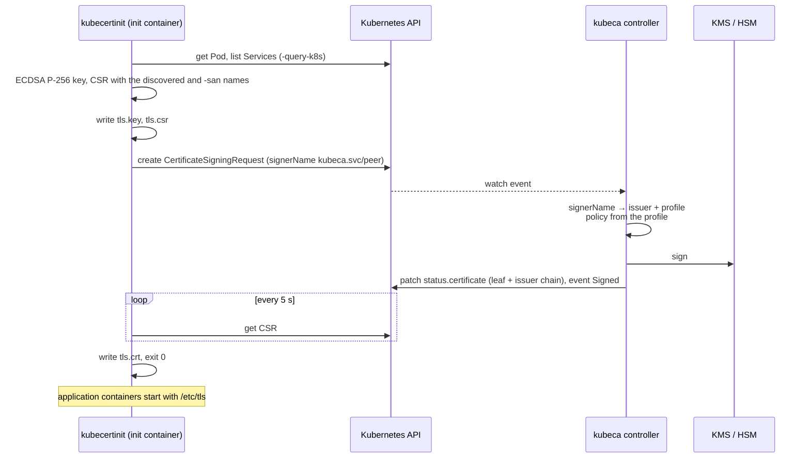

# kubeca

Certificate authority for Kubernetes workloads, built on
[xpki](https://github.com/effective-security/xpki). `kubeca` signs
`certificates.k8s.io/v1` CertificateSigningRequests with a CA key held in
AWS KMS, GCP KMS or a PKCS#11 token. `kubecertinit` is the init container
that requests a certificate for its Pod through that API and writes the
key and certificate to a shared volume.

The init-container flow is shipped and described below. The next design,
an operator with `Certificate` and `ClusterIssuer` CRDs that issues
short-lived (24 h) certificates into Secrets and renews them, is in
[`Documentation/design/operator.md`](Documentation/design/operator.md) with
its execution plan in [`PLAN.md`](PLAN.md).

## Components

| Component      | Image                            | Runs as                                   | Role                                                                                   |
| -------------- | -------------------------------- | ----------------------------------------- | -------------------------------------------------------------------------------------- |
| `kubeca`       | `effectivesecurity/kubeca`       | Deployment (Helm chart `examples/kubeca`) | Watches CSRs whose `signerName` is `<issuer-label>/<profile>` and signs them with xpki |
| `kubecertinit` | `effectivesecurity/kubecertinit` | Init container in the workload's Pod      | Generates a key, submits a CSR for the Pod, waits for the certificate, writes files    |

| Package               | Purpose                                                                     |
| --------------------- | --------------------------------------------------------------------------- |
| `cmd/kubeca`          | Controller entry point: flags, provider registration, log setup             |
| `cmd/kubecertinit`    | Init container entry point                                                  |
| `internal/controller` | controller-runtime manager, xpki authority loading, CSR reconciler          |
| `internal/certinit`   | Pod/Service name discovery, key and CSR generation, CSR submission and wait |
| `internal/logr`       | xlog adapter for controller-runtime's go-logr                               |
| `internal/version`    | Build version, linked by `make build`; printed by `-version`                |

## How it works



The signer name is `<issuer label>/<profile name>` from the xpki CA
configuration, for example `kubeca.svc/peer`. The profile decides key
usages, lifetime and which names the CSR may carry; `kubecertinit` sets
the Kubernetes `spec.usages` for information only. The controller signs any
CSR for a known signer that has no `Denied` condition; no approval step is
performed (KUBECA-001 in [`FINDINGS.md`](FINDINGS.md)).

Full description, security model and limitations:
[`Documentation/design/initcontainer.md`](Documentation/design/initcontainer.md).

## Install

### Prerequisites

- Kubernetes 1.19 or later (`certificates.k8s.io/v1`); the module builds
  against client-go v0.37.
- An issuing CA whose private key is in KMS or an HSM, created with xpki's
  `hsm-tool` (`make tools` installs it). You need three files: the issuing
  CA certificate, its key reference (a `pkcs11:` or KMS key URI, or the
  PEM the provider exports) and the root certificate.
- For AWS KMS: an IAM role with `kms:Sign`, `kms:GetPublicKey` and
  `kms:DescribeKey` on the key, bound to the controller's ServiceAccount
  (IRSA, `serviceAccount.annotations` in the chart values).

### Helm

With the release name `kubeca`, the chart's full name is `kubeca` and the
Deployment mounts the Secret `kubeca-certs-secret-tf`, which the chart does
not create:

```sh
kubectl create namespace kubeca
kubectl -n kubeca create secret generic kubeca-certs-secret-tf \
  --from-file=kubeca_ca_g1.pem --from-file=kubeca_ca_g1.key --from-file=kubeca_root.pem
helm upgrade --install kubeca examples/kubeca -n kubeca -f examples/kubeca/aws-dev.yaml \
  --set 'serviceAccount.annotations.eks\.amazonaws\.com/role-arn=arn:aws:iam::123456789012:role/kubeca'
kubectl -n kubeca logs deploy/kubeca
```

`examples/kubeca/local.yaml` targets a local KMS emulator (`kubeca-local-kms`
on port 4599) with dummy credentials. Render before installing:

```sh
helm lint examples/kubeca -f examples/kubeca/local.yaml
helm template kubeca examples/kubeca -f examples/kubeca/local.yaml --namespace kubeca
```

### Configuration

The chart mounts every file under `examples/kubeca/etc/` at `/kubeca/etc` after
rendering it with `tpl`, and passes the flags in `values.command`.

| `kubeca` flag             | Default                              | Meaning                                                                                        |
| ------------------------- | ------------------------------------ | ---------------------------------------------------------------------------------------------- |
| `-ca-cfg`                 | `/kubeca/etc/ca-config.yaml`         | xpki CA configuration (issuers and profiles)                                                   |
| `-hsm-cfg`                | `/kubeca/etc/aws-kms-us-west-2.json` | xpki token configuration of the crypto provider (`manufacturer`, `attributes`)                 |
| `-metrics-addr`           | `:9090`                              | Prometheus endpoint of the manager (`/metrics`)                                                |
| `-enable-leader-election` | `false`                              | Run one active controller when several replicas exist (needs a `leases` RBAC rule, KUBECA-012) |
| `-leader-election-id`     | `kube-ca-leader-election`            | Lease name                                                                                     |
| `-debug`                  | `false`                              | Development-mode controller-runtime logging                                                    |
| `-stackdriver`            | `false`                              | Stackdriver log format instead of JSON                                                         |
| `-version`                |                                      | Print the build version and exit                                                               |

`examples/kubeca/etc/ca-config.kubeca.yaml` defines one issuer, `kubeca.svc`,
and three profiles:

| Profile  | Signer name         | Usages                                              | Lifetime | Names copied from the CSR |
| -------- | ------------------- | --------------------------------------------------- | -------- | ------------------------- |
| `peer`   | `kubeca.svc/peer`   | signing, key encipherment, server auth, client auth | 8760h    | DNS, IP, URI              |
| `server` | `kubeca.svc/server` | signing, key encipherment, server auth              | 8760h    | DNS, IP, URI              |
| `client` | `kubeca.svc/client` | signing, key encipherment, client auth              | 8760h    | URI                       |

xpki v1.0 rules that apply (see
[`Documentation/xpki-1.0-conformance.md`](Documentation/xpki-1.0-conformance.md)):
the CSR is untrusted, so names are copied only through `allowed_fields` and
the `allowed_dns`/`allowed_uri`/`allowed_email` regexes, CSR extensions are
dropped unless listed in `allowed_extensions`, and an invalid or duplicate
name fails the request. To add a profile, add it to the file; `kubecertinit`
requests it with `-usages` (the built-in table covers `peer`, `server` and
`client`). Restrict names in production, for example:

```yaml
profiles:
  peer:
    issuer_label: kubeca.svc
    expiry: 8760h
    backdate: 30m
    usages: [signing, key encipherment, server auth, client auth]
    allowed_uri: ^spiffe://example\.org/ns/[a-z0-9-]+/sa/[a-z0-9-]+$
    allowed_dns: ^[a-z0-9-]+(\.[a-z0-9-]+)*\.(svc|pod)(\.cluster\.local)?$
    allowed_fields:
      uri: true
      dns: true
      ip: true
```

The `-hsm-cfg` file selects the provider; `etc/aws-kms-us-west-2.yaml` is
`manufacturer: AWSKMS`, `model: effective-security-test`, `attributes: Region=us-west-2`.
GCP KMS needs `Keyring` in the attributes; PKCS#11 needs `TokenLabel` or
`TokenSerial`. The issuer `key:` is the key URI the provider exported when
the key was created.

## Requesting certificates from a Pod

Add `kubecertinit` as an init container that writes into a volume the
application containers mount. The example below is plain YAML; a Helm
version with the same values is in
[`examples/initcontainer`](examples/initcontainer).

```yaml
spec:
  serviceAccountName: web
  volumes:
    - name: tls
      emptyDir:
        medium: Memory
  initContainers:
    - name: certificate-init
      image: effectivesecurity/kubecertinit:main
      env:
        - name: NAMESPACE
          valueFrom: { fieldRef: { fieldPath: metadata.namespace } }
        - name: POD_NAME
          valueFrom: { fieldRef: { fieldPath: metadata.name } }
        - name: POD_IP
          valueFrom: { fieldRef: { fieldPath: status.podIP } }
      args:
        - -namespace=$(NAMESPACE)
        - -pod-name=$(POD_NAME)
        - -signer=kubeca.svc/peer
        - -cert-dir=/etc/tls
        - -query-k8s
        - -san=spiffe://example.org/ns/$(NAMESPACE)/sa/web,localhost,$(POD_IP)
      volumeMounts:
        - name: tls
          mountPath: /etc/tls
  containers:
    - name: web
      image: example/web
      volumeMounts:
        - name: tls
          mountPath: /etc/tls
          readOnly: true
```

| `kubecertinit` flag    | Default         | Meaning                                                                                                                             |
| ---------------------- | --------------- | ----------------------------------------------------------------------------------------------------------------------------------- |
| `-namespace`           |                 | Pod namespace (required)                                                                                                            |
| `-pod-name`            |                 | Pod name (required)                                                                                                                 |
| `-signer`              |                 | `<issuer label>/<profile>` (required); a profile other than `peer`, `server` or `client` needs `-usages`                            |
| `-cert-dir`            | `/etc/tls`      | Output directory; must exist                                                                                                        |
| `-san`                 |                 | Comma-separated DNS names, IPs, URIs (`scheme://...`) and emails to add                                                             |
| `-query-k8s`           | `false`         | Add the Pod's DNS name, its hostname/subdomain name and the names and IPs of Services that select it                                |
| `-cluster-domain`      | `cluster.local` | Suffix for the names above                                                                                                          |
| `-include-unqualified` | `false`         | Also add the `.svc` names without the cluster domain                                                                                |
| `-labels`              |                 | `key=value,...` labels for the CSR object                                                                                           |
| `-service-names`       |                 | Comma-separated Service names in the Pod's namespace; each adds `<name>.<ns>.svc.<domain>` (and `.svc` with `-include-unqualified`) |
| `-usages`              |                 | Comma-separated `certificates.k8s.io` key usages to request; overrides the built-in table                                           |
| `-timeout`             | `0`             | Give up waiting for the certificate after this duration and exit 2; `0` waits for ever                                              |
| `-kubeconfig`          |                 | Optional kubeconfig; empty means in-cluster                                                                                         |
| `-stackdriver`         | `false`         | Stackdriver log format                                                                                                              |
| `-version`             |                 | Print the build version and exit                                                                                                    |

The workload's ServiceAccount needs to create and read CSRs (a ClusterRole,
since CSRs are cluster-scoped) and, with `-query-k8s`, read Pods and
Services in its own namespace (a Role); see
[`examples/initcontainer/rbac.yaml`](examples/initcontainer/rbac.yaml).

Output files in `-cert-dir`:

| File      | Content                                                                                                      | Mode              |
| --------- | ------------------------------------------------------------------------------------------------------------ | ----------------- |
| `tls.key` | ECDSA P-256 private key, PEM                                                                                 | 0644 (KUBECA-003) |
| `tls.csr` | The CSR, PEM                                                                                                 | 0644              |
| `tls.crt` | The certificate, then the issuing CA certificate and the `ca_bundle` intermediates; the root is not included | 0644              |

The init container exits 0 when the certificate is issued, and 2 when the
CSR gets a `Denied` or `Failed` condition, is deleted, or `-timeout` elapses
(without the flag it waits for ever, KUBECA-006; the example sets 10
minutes, after which the kubelet restarts the init container). The
controller does not renew certificates, hence the year-long profiles; see
the limitations in the design document.

## Operations

- Logs: JSON on stderr (xlog) with caller, or Stackdriver with
  `-stackdriver`; controller-runtime's own lines use the same format
  (`src=controller-runtime.metrics`). One `NOTICE` line per signed CSR with
  `name`, `issuer`, `profile`, `serial`, `not_after` and `elapsed`; the
  certificate text at `DEBUG` (`-debug`). Both commands log their version
  at start-up and print it with `-version`.
- Metrics: `/metrics` on `-metrics-addr` serves the controller-runtime
  metrics (`controller_runtime_reconcile_total{controller="certificatesigningrequest"}`
  and friends) and xpki's `perf_ca_signreq{issuer,profile}`.
- Events on the CSR: `Signed`, and a `SigningFailed` warning with the
  error for every failed attempt.
- `kubectl get csr` shows every request; the kube-controller-manager
  garbage-collects issued CSRs after about an hour and pending ones after
  24 hours.

| Symptom                                                               | Check                                                                                          |
| --------------------------------------------------------------------- | ---------------------------------------------------------------------------------------------- |
| Pod stays in `Init:0/1`                                               | `kubectl get csr`, `kubectl describe csr <pod>-<ns>-...`; controller logs for `unable to sign` |
| `unsupported signer` / `unsupported profile` in init logs             | `-signer` must be `<label>/<profile>` with a profile known to `kubecertinit`                   |
| `forbidden` creating the CSR                                          | Bind the `csr-creator` ClusterRole to the workload's ServiceAccount                            |
| Controller logs `issuer not found`                                    | The signer label does not match an issuer `label` in `ca-config`                               |
| `SigningFailed` event, `invalid SAN` or `does not match allowed list` | The CSR carries a name the profile rejects; the CSR is retried until deleted (KUBECA-013)      |
| `unable to load HSM config` at start                                  | `-hsm-cfg` path, provider `manufacturer`, KMS credentials (IRSA annotation)                    |

## Key ceremony

`scripts/gen_root.sh` creates the root key on one KMS and self-signs the
root; `scripts/gen_ca.sh` creates the G1 issuing key and CSR on the KMS
kubeca uses and has the root sign it, so the root KMS can stay offline.
Locally, two `local-kms` emulators play the two KMS:

```sh
make start-local-kms          # kms1 :14599 (root), kms2 :24599 (issuing)
make kubeca-ceremony-local    # .tmp/kubeca_root_local.pem, .tmp/kubeca_ca_g1_local.{pem,key}
```

Procedure, inputs and the AWS variant:
[`Documentation/key-ceremony.md`](Documentation/key-ceremony.md).

## Local test with minikube

With a running minikube and the local ceremony done:

```sh
make minikube-images     # make build change_log, docker build, minikube image load
make minikube-deploy     # namespace kubeca, certs Secret from .tmp, helm install with examples/kubeca/minikube.yaml
make minikube-test       # dummy workload with the init container; verifies the certificate and the log format
make minikube-clean      # removes the workload, the release and the namespaces
```

`make minikube-all` runs every step. kubeca reaches the issuing emulator
through `host.minikube.internal:24599`
(`examples/kubeca/etc/aws-dev-kms-minikube.yaml`); the dummy workload is
`examples/initcontainer/dummy-deployment.yaml` (busybox plus the init
container, namespace `shop`). The test checks that the CSR was signed, that
the Pod holds `tls.key`, `tls.csr` and `tls.crt`, that the certificate
chains to the ceremony root with the Pod, Service, SPIFFE and `-san` names,
and that every kubeca log line is a JSON object with `time`, `level` and
`pkg`.

## Development

```sh
make tools        # golangci-lint, govulncheck, cov-report, hsm-tool, xpki-tool
make build        # bin/kubeca, bin/kubecertinit
make test         # unit tests; RACE=true adds the race detector
make lint         # fmt, vet, govulncheck, golangci-lint
make covtest      # coverage; `make coverage` opens the report
make change_log docker   # images effectivesecurity/{kubeca,kubecertinit}:main
```

`make build` links the version (`v<.VERSION>.<commit count>`) into both
binaries; `kubeca -version` and `kubecertinit -version` print it. Unit
tests need no cluster, KMS or Docker. CI runs `make build covtest` on
pull requests and pushes, publishes the images on pushes to `main`, and
tags `v<.VERSION>.<commit count>` when `.VERSION` changes. The chart is
validated with `helm lint` and `helm template` (see above).

## Documentation

- [`AGENTS.md`](AGENTS.md): rules for contributors and agents.
- [`Documentation/codemap.md`](Documentation/codemap.md): concept index,
  entry points and invariants per package.
- [`Documentation/design/`](Documentation/design/README.md): current
  init-container design, operator architecture and API.
- [`Documentation/xpki-1.0-conformance.md`](Documentation/xpki-1.0-conformance.md):
  xpki v1.0 changes and their effect here.
- [`examples/`](examples/README.md): manifests for both designs.
- [`Documentation/RELEASE_NOTES_0.8.md`](Documentation/RELEASE_NOTES_0.8.md):
  what changed in v0.8.
- [`FINDINGS.md`](FINDINGS.md), [`ROADMAP.md`](ROADMAP.md), [`PLAN.md`](PLAN.md).
